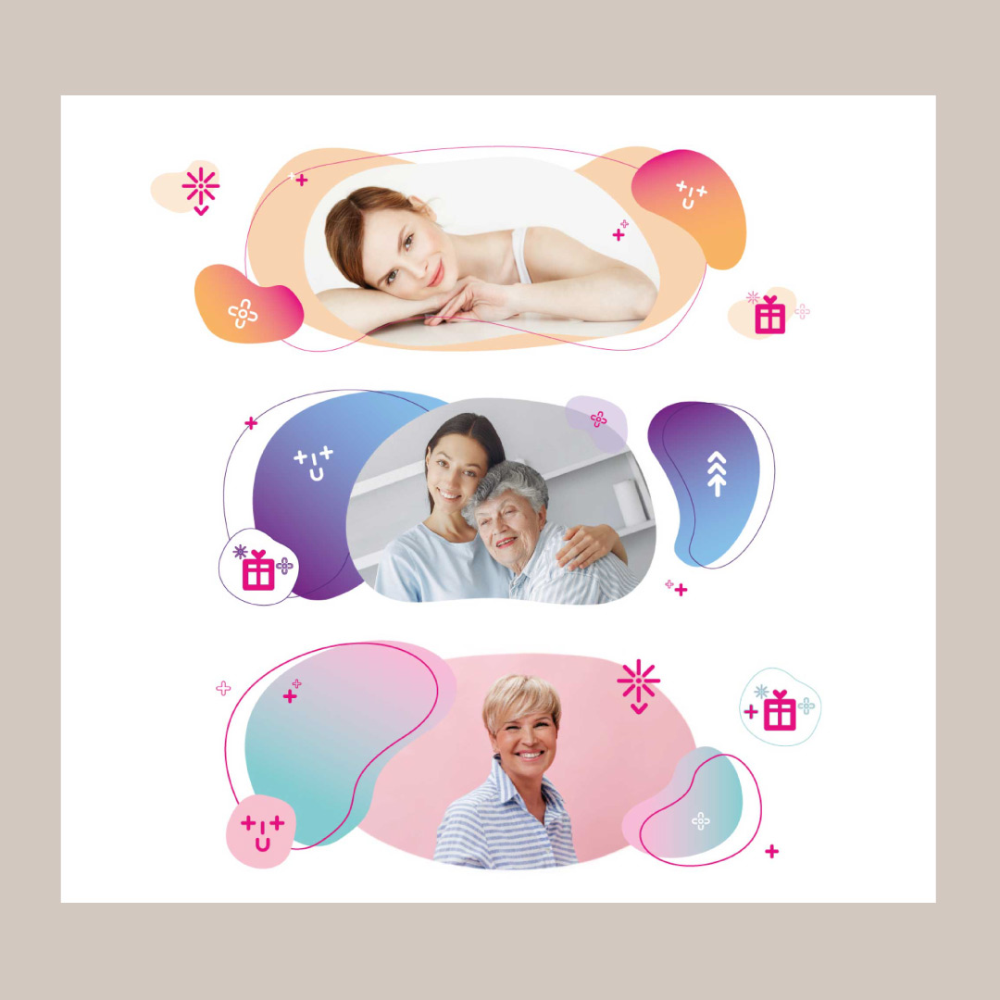

# Impression

## Work by Eva Junková

Hi! My name is Eva Junková. I will show you some of my work. I prefer clear, easy and harmonic design. 

**Alt text:** Collage poster created in Photoshop and Procreate - mood FRANCE. Harmononic purple flower design. 

**Alt text:** Collage poster created in Photoshop and Procreate - mood NEW ZEALAND. Calm mother of nature. 

**Alt text:** Blue collage poster created in Photoshop and Procreate - mood CHINA. Calm vibe of ocean.

**Alt text:** Web banners for online shop Pilulka CZ/SK. Playful and colorful composition.

**Alt text:** Web design for online shop Pilulka CZ/SK. Cheerful and colorful design.

**Alt text:** Decent wedding announcement. Flowers in matte colors.

**Alt text:** Digital and ink illustration created by myself. Harmonic and distinctive art. 

