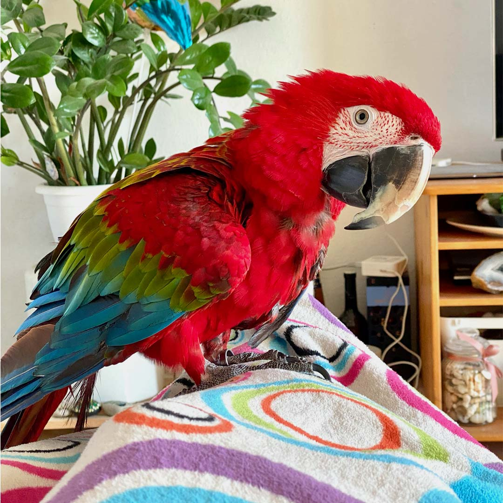

# Eva Junková

- [View Selected Case Study](case-study.md)

Hi! I am Eva, graphic designer, arranger, illustrator and dreamer. Under this text you can see my buddy for every day inspiration.

**Alt text:** Finny in natural habitat. 🦜

## My story

I live in Prague since I was a child. Already in elementery school I was very interested in illustrating and graphic design. My elementery school wasn't specialised in grapfic design so I attended school of art every Thursday. I really enjoyed it. After elementery school I was very confused. I didn't know if I still wanted to continue with graphic design, but I gave it a chance. After elementary school I started studying high school of graphic design (Náhorní). It gave me some experience.

And now I am here! At this moment it is my third year studying in college of graphic design and creative communication. It is really funny, because after elementary school I wanted to be a criminalist or policewoman. Why policewomen? I used to like to watch tv shows about serial killers and mysterious murders. 

One of my hobbies is arranging. I like to work with fabrics, colors, special materials and wood. Also I love going workout to my favourite gym Eagle fitness. I'm not a loner, but I like to workout alone without friends. 

## Why you should choose me?

When you imagine a unique design a lot of people will say that it is about color, typography or look. But this is not all. The design must be smart and usable in all directions. When I work, I always follow this rule and it's completely worth it. Let's create a unique and clever design together. 

