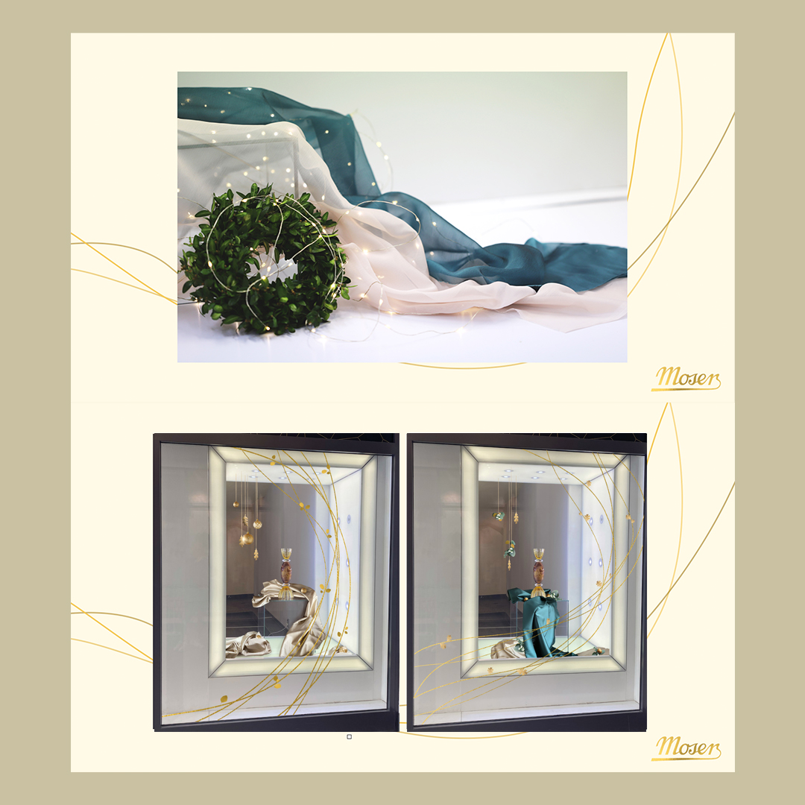

# Moser presentation 🥂

I would like to introduce you my recent project for glass shop MOSER. I got this big project from graphic design studio (Studio 66).

## About Moser 🏆

Moser is a Czech company focused on the production of lead-free handcrafted luxury crystal. The company began in 1857 when Ludwig Moser, a talented engraver and businessman opened an engraving workshop and store in the spa town of Karlovy Vary. The Moser trademark became the world's concept of luxury crystal and the symbol of perfect manual processing.

## Brief 👩🏽‍💻

In the beginning, they gave me some materials and information about brand. Also I cooperated with two girls from production. So we had little team for this project. Deadline for this presentation was only two days instead of two weaks. It was very stressful. 

- Christmas identity and arrangement for Moser
- Staircase decoration, christmas wreaths
- Shop window decoration
- Snacks + punch cups
- Entrance space decoration
- No typical Christmas colors (no cones and flakes)

## Decorations 🍃

The company didn't want typical christmas colors and decorations. So I had to make something special. 

- Flowers: Eucalyptus, Buchsus, gold nuts
- Snacks = gold macaroons named moser, vanilla rolls
- Color pallette = dark green (eucalyptus), light green, gold, beige

## Slides of presentation 🎬

**Alt text:** Snacks and decorations 

**Alt text:** Decoration in a shop window

**Alt text:** Moser cups

## No time for stress 🤯

Manager gave me for this presentation only 2 days. These days were the most stressful days of my life, because I didn't have enought informations and materials for this presentation. 

## What this work gave me?

This work gave me new experience with arranging, graphic design and cooperation with people.

