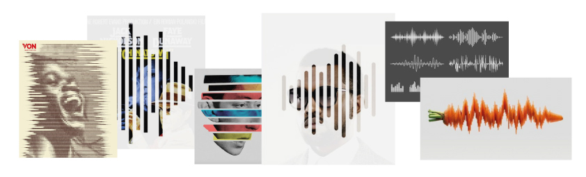
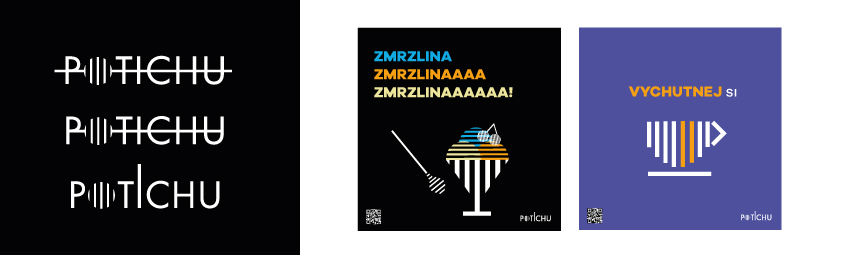

- [Summary](#summary)
- [SWhat Problems did the project solve?](#What Problems did the project solve?)
- [Keywords](#keywords)
- [Key Points](#key-points)
- [Inspiration](#inspiration)

# Quiet cafe

Quiet cafe is the first cafe in Prague with deaf staff. The company has become a place where you can meet both worlds - hearing and deaf. Exhibitions, concerts and other cultural and educational events are held here regularly. Especially in the warmer months, you can look forward to a pleasant sitting in the garden.

## Summary

My project focuses on connecting the world of the hearing and the deaf. The most important think for me is the overall unification of visual identity and the creation of marketing communication. I will create a new logo, posters, menu, uniforms and interier design for the company. This cafe is very special, because when you came inside you can't hear nothing. It is absolutelly calm and harmonic place. I was there last week and it was really cool. The service was very nice.

## What Problems did the project solve?

## Keywords
Quiet cafe, graphic design, visual identity, deaf, marketing, sign language, typography, pictograms, social networks, advertisement

## Key Points

1. Background/importance of topic: I think people should more talk about this handicap (deaf). 
In my project, I want to spread better awareness about this handicap. The café will be not only for the deaf but also for the hearing.

2. Purpose/hypothesis (thesis or statement of problem):
My main purpose is to unify visual identity and marketing communication. I want the café to become known to the general public. I don't want it to be just a cafe, I want it to be a place where you can relax and get to know a new world (deaf world).

3. Research — design/methodology/approach including procedures/data/observations:
My research was based on books about design, typography and marketing. My aunt who is deaf helped me a lot. I asked her various questions about this handicap, which I can use in the charts. I also looked for other cafes in Prague, I focused on their websites, marketing communication and promotion. The competition analysis brought my work full of benefits

4. Findings (highlight outcome of research):
The main finding was that the deaf did not want people to feel sorry for them. They are self-sufficient people who can teach us something more about quit word. 

5. Conclusions (significance/success of study to theory/practical/society):
I'm still working on it. The bachelor thesis is still evolving and a lot of things can change. 

## Inspiration

I am working with sound wave in my visual identity. So here is some of mine inspiration that I found on pinterest. 

Some of mine graphics that is connected with sound wave. 
