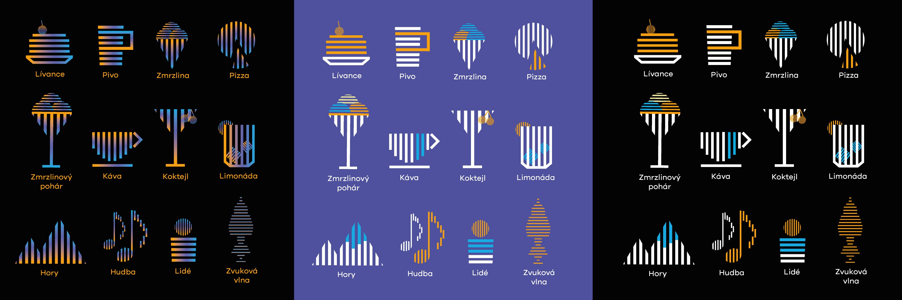

# Visual identity of a Quiet cafe

## Abstract

I want to connect two worlds that have not been connected yet. Connecting the deaf and hearing will bring a lot of new customers to the cafe. These two groups will share new knowledge and experience to eachother. 

## Keywords

Quiet cafe, deaf, graphic design, pictograms, design strategy, creative communication.

## Presentation

Quiet cafe - visual communication

### Logo 
### Pictograms 

### Posters
### Instagram post
### Inspiration
