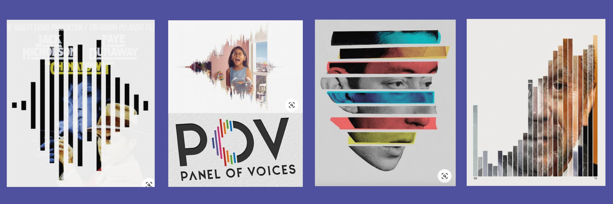
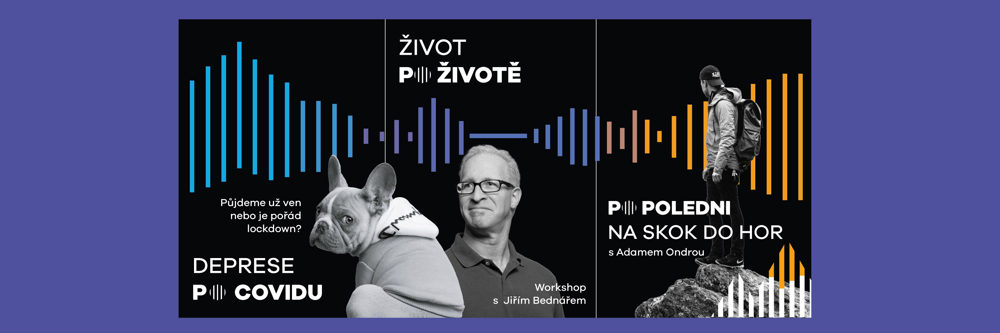
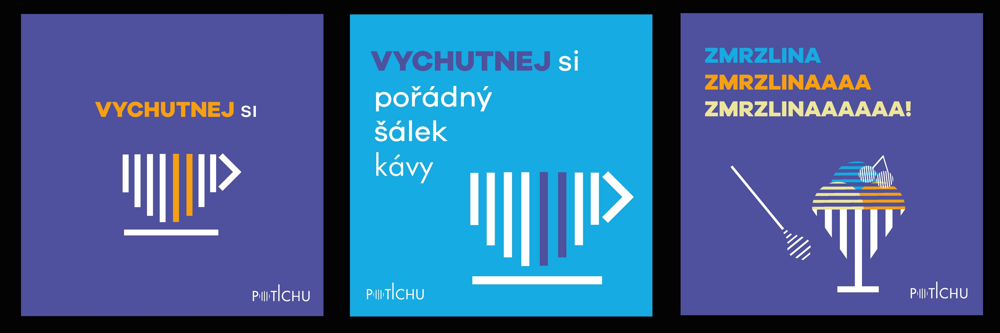

# Visual identity of a Quiet cafe ☕️

## Abstract ✨

I want to connect two worlds that have not been connected yet. Connecting the deaf and hearing will bring a lot of new customers to the cafe. These two groups will share new knowledge and experience to eachother. 

## Keywords 💫

Quiet cafe, deaf, graphic design, pictograms, design strategy, creative communication.

## Presentation 🌟

Quiet cafe - visual communication

### Inspiration

### Logo 

### Pictograms 

### Posters
There will be some changes, I need to consult some things about poster design with my profesor. 

### Instagram post

